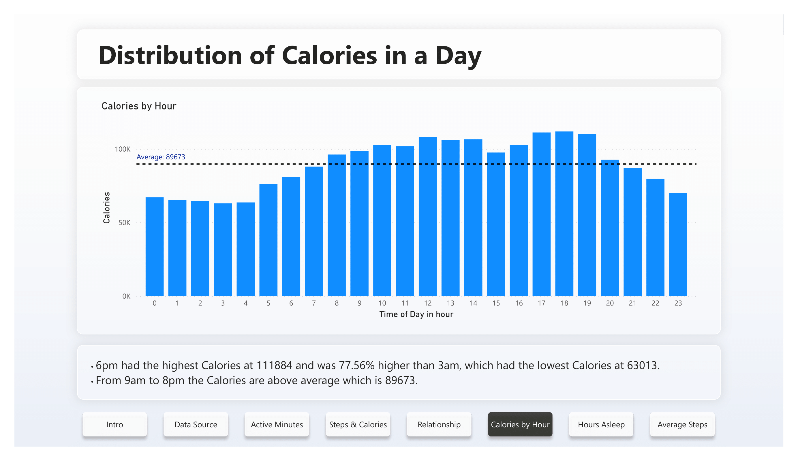

# Case Study: How Can a Wellness Technology Company Play It Smart?

## Case study Background
This case Study is about Bellabeat, a high-tech manufacturer of health-focused products. By analyzing smart device finess data, it help unlock new growth opportunities for the company.

This case study will be foucsed on these 3 questions:

-What are some trends in smart device usages?\
-How could these trends apply to Bellabeet customers?\
-How could these trends help influence Bellabeat marketing strategy?

## Data Source

The Datasets used is FitBit Fitness Tracker Data. The dataset are made available through Mobius.

The dataset are generated by respondents to a distributed survey via Amazon Mechanical Turk between 12 March 2016 and 12 May 2016.

There are 18 csv files and we will be using the files named below:

dailyActivity_merged.csv\
hourlyCalories_merged.csv\
hourlySteps_merged.csv\
sleepDay_merged.csv

I have imported the 4 csv files into Power Bi.

The sample size of the data is small (30 users) and the data is from 6 years ago, the dataset cannot represent the current population. The case study will only base on the 30 users at the time they took the survey.

## Data Analysis
Data is analysis and visualize through Power Bi.
Link to Power Bi report: [Bellabeat_Bi_report](Bellabeat Data Analysis Case Study.pbix)

